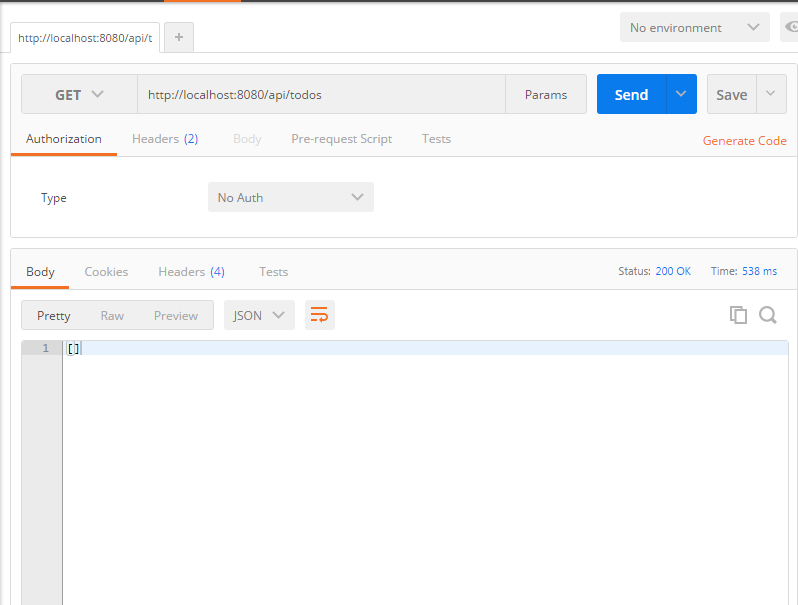
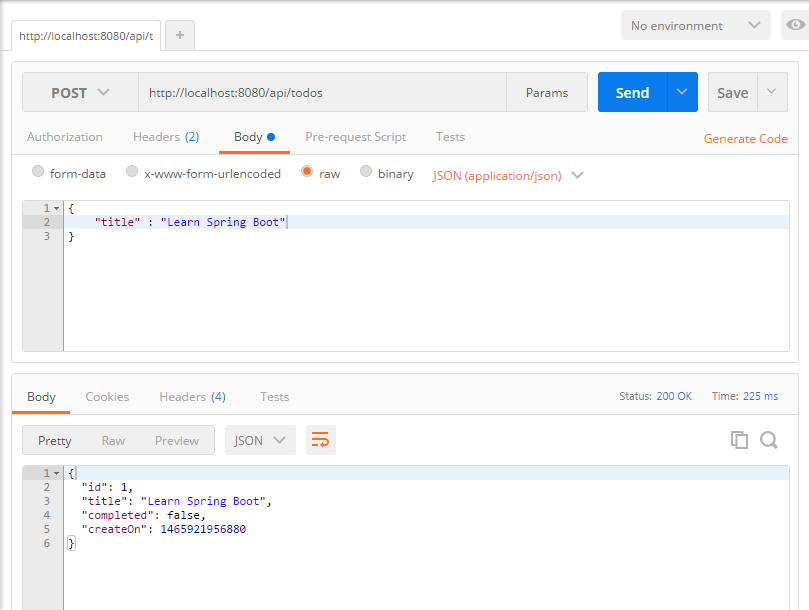
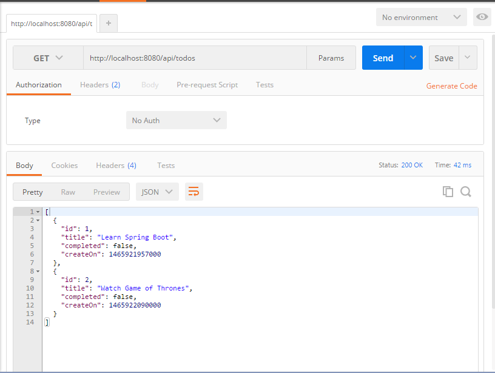
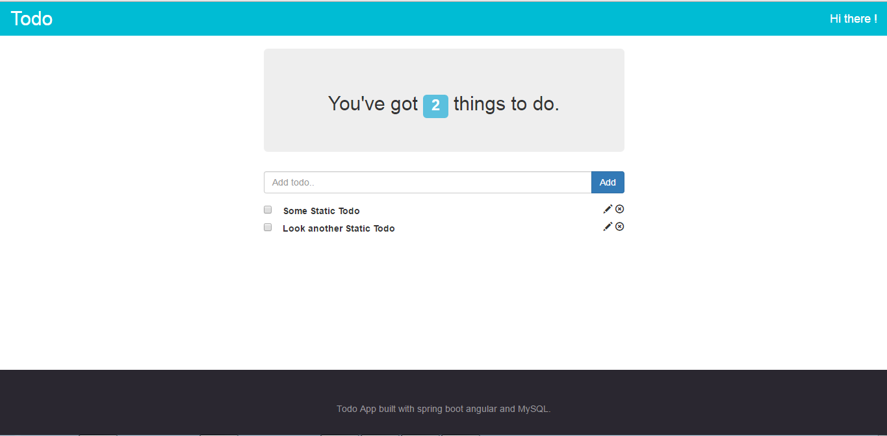

#Spring Boot with Embedded Database Support

It’s often convenient to develop applications using an in-memory embedded database. Obviously, in-memory databases do not provide persistent storage; you will need to populate your database when your application starts and be prepared to throw away data when your application ends. We use [HSQL](http://hsqldb.org/) as our embedded db.

#Building a Todo backend service with Spring Boot & HSQL

The Aim of this tutorial is to build a simple todo backend services which can be used with any front end framework to build an app.

##Directory Structure

    |___src
        |___main
            |__java
                |__todo
                    --TodoApplication.java
                    |__controllers
                        --TodoController.java
                    |__models
                        --Todo.java
                    |__repositories
                        --TodoRepository.java
            |__resources
                |__application.properties
    --pom.xml

**Note** : If you are using eclipse change the package name to **todo** or use the proper package name in the rest of the code.

Spring Boot picks up your java resources from the path src/main/java. TodoApplication.java is the entry class for our application.
All your resources are picked up from src/main/resources. It contains application.properties which includes database configuration.

##pom.xml

The pom.xml file looks like this..

    <project xmlns="http://maven.apache.org/POM/4.0.0" xmlns:xsi="http://www.w3.org/2001/XMLSchema-instance"
    xsi:schemaLocation="http://maven.apache.org/POM/4.0.0 http://maven.apache.org/maven-v4_0_0.xsd">
    <modelVersion>4.0.0</modelVersion>
    <groupId>com.amit</groupId>
    <artifactId>spring-hsql-todo</artifactId>
    <packaging>jar</packaging>
    <version>0.0.1-SNAPSHOT</version>
    <name>Todo</name>
    <url>http://maven.apache.org</url>
    
    
    <parent>
        <groupId>org.springframework.boot</groupId>
        <artifactId>spring-boot-starter-parent</artifactId>
        <version>1.3.3.RELEASE</version>
    </parent>
    
    <dependencies>
        <dependency>
            <groupId>org.springframework.boot</groupId>
            <artifactId>spring-boot-starter-web</artifactId>
        </dependency>
        
        <dependency>
            <groupId>org.springframework.boot</groupId>
            <artifactId>spring-boot-starter-data-jpa</artifactId>
        </dependency>
        
       <dependency>
            <groupId>org.hsqldb</groupId>
            <artifactId>hsqldb</artifactId>
            <scope>runtime</scope>
       </dependency>
    </dependencies>

    </project>

###Install Dependencies

* If you are using eclipse, right click on the your project select **Run As** --> **Maven Install**                                                                                                                             

* if you are not using IDE, run the following from the root of the folder (make sure you have Maven installed)

        mvn install

##Application.properties

HSQL do not require any special properties to be set in resources/application.properties file. You can see common application properties used by spring [here](https://docs.spring.io/spring-boot/docs/current/reference/html/common-application-properties.html)
    
    spring.datasource.platform=hsqldb

Embedded DBs are in-memory and each time the application shuts down the schema and data gets erased. One way to keep schema and data in the in-memory is to populate it during application startup. This is taken care by Springboot.
One of the approaches is to create `schema.sql` and `data.sql` files in the application classpath.

One can create mulptiple schema.sql and data.sql files, one for each db platform. So we can have `schema-hsqldb.sql`, `data-hsqldb.sql`, `schema-mysql.sql` and so on. And the file to be picked is decided by the value assigned to the property `spring.datasource.platform` in our `application.properties` file.

We will create a `schema-hsqldb.sql` to define our schema and Spring Boot will create this schema when ever our application starts. Create a schema-hsqldb.sql in src/main/resources  with the following content : 

    CREATE TABLE todos (
    id INTEGER IDENTITY PRIMARY KEY,
    completed bit(1) DEFAULT NULL,
    created_on TIMESTAMP DEFAULT NULL,
    title varchar(255) NOT NULL,
    );

##Lets Code!! 

Lets start listening to the sweet keystrokes shall we?

###Application Class
The Application class is the starting point of spring boot's project. Create a TodoApplication.java in src/main/java/todo.

    package todo;

    import org.springframework.boot.SpringApplication;
    import org.springframework.boot.autoconfigure.SpringBootApplication;

    @SpringBootApplication
    public class TodoApplication {
        public static void main(String[] args){
            SpringApplication.run(TodoApplication.class, args);
        }
    }

The `@SpringBootApplication` annotation tells the Spring Boot that this is our main application class.The `main()` method uses Spring Boot's `SpringApplication.run()` to launch the application.
The `@SpringBootApplication` annotation is equivalent to using `@Configuration`, `@EnableAutoConfiguration` and `@ComponentScan` with their default attributes.

###Defining a model (not the super models.. DAMN!!!)

Spring Boot is a MVC(model view controller) architecture. A Model is mapped to a table in our DB. Create Todo.java inside src/main/java/todo/models

    package todo.models;

    import java.util.Date;

    import javax.persistence.Entity;
    import javax.persistence.GeneratedValue;
    import javax.persistence.GenerationType;
    import javax.persistence.Id;
    import javax.persistence.Table;

    import org.hibernate.validator.constraints.NotBlank;

    @Entity
    @Table(name="todos")
    public class Todo {
        
        @Id      //indicates that this field is a primary key
        @GeneratedValue(strategy = GenerationType.IDENTITY) 
        private long id;
        
        @NotBlank
        private String title;
        
        private Date createdOn = new Date();
        
        private Boolean completed = false;

        public long getId() {
            return id;
        }

        public void setId(long id) {
            this.id = id;
        }

        public String getTitle() {
            return title;
        }

        public void setTitle(String title) {
            this.title = title;
        }

        public Date getCreateOn() {
            return createdOn;
        }

        public void setCreateOn(Date createOn) {
            this.createdOn = createOn;
        }

        public Boolean getCompleted() {
            return completed;
        }

        public void setCompleted(Boolean completed) {
            this.completed = completed;
        }

        public Todo(String title) {
            super();
            this.title = title;
        }

        public Todo() {
            super();
        }
        
        

    }

The `@Entity` annotation indicates that the JavaBean is a persistent entity, JPA would automatically pick up this class.An `@Table` annotation can explicitly configure which table the entity is mapped to. In our case the `@Table(name="todos")` maps the entity to todos table.

###Repository for accessing data
We will use `CrudRepository` for accessing/manipulating the data. It includes all the basic operations like creating, updating, deleting and retrieving items. If we need anything else, we can always create custom methods. Create TodoRepository.java inside src/main/java/todo/repositories –

    package todo.repositories;

    import java.util.List;

    import org.springframework.data.repository.CrudRepository;
    import org.springframework.stereotype.Repository;

    import todo.models.Todo;

    @Repository
    public interface TodoRepository extends CrudRepository<Todo, Long>{
        
        public List<Todo> findAll(); //returns all todos
        public Todo findOne(Long id);
        public Todo save(Todo todo);
        public void delete(Long id);

    }

###Controller

We define our APIs in this file.All apis in this controller will have a prefix `/api/todos` which is specified using `@RequestMapping`. In each controller method we call specific repository methods for accessing/modifying the data.

In src/main/java/todo/controllers create a class TodoController.java - 

    package todo.controllers;

    import java.util.List;

    import javax.validation.Valid;

    import org.springframework.beans.factory.annotation.Autowired;
    import org.springframework.http.HttpStatus;
    import org.springframework.http.ResponseEntity;
    import org.springframework.web.bind.annotation.PathVariable;
    import org.springframework.web.bind.annotation.RequestBody;
    import org.springframework.web.bind.annotation.RequestMapping;
    import org.springframework.web.bind.annotation.RequestMethod;
    import org.springframework.web.bind.annotation.RestController;

    import todo.models.Todo;
    import todo.repositories.TodoRepository;

    @RestController
    @RequestMapping("/api/todos")
    public class TodoController {

            @Autowired
            private TodoRepository todoRepository;
            
            @RequestMapping(method = RequestMethod.GET)
            public List<Todo>getAllTodos(){
                return todoRepository.findAll();
            }
            
            @RequestMapping(method = RequestMethod.POST)
            public Todo createTodo(@Valid @RequestBody Todo todo){
                return todoRepository.save(todo);
            }
            
            @RequestMapping(value="{id}", method = RequestMethod.GET)
            public ResponseEntity<Todo> findOne(@PathVariable("id") Long id){
                Todo todo = todoRepository.findOne(id);
                if(todo == null){
                    return new ResponseEntity<Todo>(HttpStatus.NOT_FOUND);
                }
                return new ResponseEntity<Todo>(todo,HttpStatus.OK);
            }
            
            @RequestMapping(value="{id}", method = RequestMethod.PUT)
            public ResponseEntity<Todo> updateTodo(@Valid @RequestBody Todo todo, @PathVariable("id") Long id){
                Todo todoDb = todoRepository.findOne(id);
                if(todoDb == null){
                    return new ResponseEntity<Todo>(HttpStatus.NOT_FOUND);
                }
                else{
                    todoDb.setTitle(todo.getTitle());
                    todoDb.setCompleted(todo.getCompleted());
                    todoDb = todoRepository.save(todoDb);
                    return new ResponseEntity<Todo>(todoDb,HttpStatus.OK);
                }
            }
            
            @RequestMapping(value="{id}", method = RequestMethod.DELETE)
            public void deleteTodo(@PathVariable("id") Long id) {
                todoRepository.delete(id);
            }
    }

In Spring’s approach to building RESTful web services, HTTP requests are handled by a controller. These components are easily identified by the `@RestController` annotation.  

`@RequestMapping` is used to map web requests to Spring Controller methods.

##Result

All right girls and guys we are done. To run the service
* If you are using eclipse right click on your project select **Run As** --> **Java Application** and select **TodoApplication** . To Stop the application gracefully press the red button (terminate) right of the console tab.

* if you wabt to run from the terminal then open a terminal and run the following from the root folder

        mvn spring-boot:run
Press `CTRL+C` to gracefully close the app.

If every thing is okay, and the code has no errors you would propably see this in the last line

    2016-06-14 21:57:35.879  INFO 8948 --- [main] todo.TodoApplication : Started TodoApplication in 8.5 seconds (JVM running for 14.439)

##Insert and get data

You could use [postman](https://www.getpostman.com/) to test your services.

* Start your postman app from your chrome app launcher

* Select `GET` from the dropdown and enter url as - `http://localhost:8080/api/todos` 

* you would get an empty response in body like this : 

  

* Select `POST` from the dropdown let the url be the same as previous one. Select the `body` option and click on `raw` radio box. Selct `JSON(application/json)` from the drop down next to the radio box.
  Enter the following for the body and press `send`.

       { "title": "Learn Spring Boot"}
    

* `Post` as many todos you want and then do a `GET`. My `GET` looked like this

    

* You can edit a todo by using `PUT` and calling url - `http://localhost:8080/api/todos/1` where /1 is the id of the todo you want to edit. send appropriate body to edit the todo title.

* Test Delete too.

#Front End

Its time to use our backend service with a cool front end to give it a look and feel of a web app. We will use [angularjs](https://angularjs.org/) as our front end framework. We will use [bower](https://bower.io/) as our front end dependency management. To start using bower we need [npm](https://www.npmjs.com/). Now to get `npm` you must install [node](https://nodejs.org/en/) .**AHHH man how many things do i have to download??** Just `node` rest all is just few commands away, trust me in future this dependency management will save a lot of your hair pulling time. So lets get started.

* Download [node js](https://nodejs.org/en/) and follow the wizard to install it. Node also installs `npm` for you. To check if the installation was successfull open a terminal and type

        npm -v

   If all went well it would print the version number of `npm` installed.

* Install `bower` by running the following from a terminal : 
        
        npm install bower -g
    
   '-g' installs bower globally so you could use it from anywhere.

* Add `.bowerrc` file in your projects root folder with the following content

        {
            "directory": "src/main/resources/static/vendors",
            "json": "bower.json"
        }

   **What is `.bowerrc`**?
   `.bowerrc` is a configuration file which bower picks up. We say bower to install all the dependencies that we create in `src/main/resources/static/vendors`.

* Add `bower.json`file in your projects root folder with the following content : 

        {
        "name": "Todo",
        "version": "1.0.0",
        "dependencies": {
            "angular": "^1.5.2",
            "bootstrap-css-only": "^3.3.6"
            }
        }

   `bower.json` contains information about your front end dependencies. You can see we have included `angular` and `bootstrap` as our dependencies.We use `bootstrap` to style up our app.  
   
   **Pro Tip** : Open your terminal from your projects root folder and type `bower init` to let bower interactively generate `bower.json` based on your inputs.

* Finally run `bower install` from your project's root in a terminal to install required dependencies.

##Directory Structure (FrontEnd)

    |__ src/main/resources
        |__ static
            |__ modules
                |__ core
                    |__ app
                        -- config.js
                        -- init.js
                |__ todo
                    |__ controllers
                        -- todo.client.controller.js
                    |__ services
                        -- todo.client.service.js
                    -- todo.client.module.js
            |__ assets
                |__ css
                    -- todo.css
            |__ vendors

            -- index.html

Spring Boot serves static assets from `src/main/resources/static`. Index.html is served when we open `http://localhost:8080` after starting the server. The rest of the directory structure is our convention which we follow.

##Explaning the structure
`vendors` : This folder will contain all the dependencies downloaded via `bower`.

`assets` : This folder will contain any custom css we write. Any Images we want to be displayed etc.

`modules` : This folder contains all the modules that make up our front end. At present it has a `core` and `todo` module. The purpose of `core` module is to bootstrap angular to our html and provide a useful api to register a module. The `todo` module deals with creating/editing/deleting todos. It has a `services` folder which contains `todo.client.service.js`. Its main job is to interact with our back end and pass this data to `controllers`.

##index.html(static)

Before we jump to angular lets build  a static page which gets served eveytime we call `http://localhost:8080`. Create an `index.html` page in `src/main/resources/static` with the following content:
**Make sure you have done `bower install` in a terminal, from your projects root, because we use bootstrap in this file**.

    <html>

    <head>
        <!-- META -->
        <meta charset="utf-8">
        <!-- Optimize mobile viewport -->
        <meta name="viewport" content="width=device-width, initial-scale=1">

        <title>Todo App</title>
        <link href="vendors/bootstrap-css-only/css/bootstrap.min.css" rel="stylesheet">
        <link rel="stylesheet" href="assets/css/style.css">
    </head>

    <body>

        

            <!-- Header -->

            <nav class="navbar navbar-default">
                

                    

                        <a class="navbar-brand">Todo</a>
                    

                    <ul class="nav navbar-nav no-content navbar-right">
                        <li><a> Hi there !</a></li>
                    </ul>
                

            </nav>

            <!--  main - content  -->
            

                

                    

                        

                            <h2>You've got 2 things to do.</h2>
                        

                    

                

                

                    

                        <form role="form" name="createForm">
                            

                                

                                    <input type="text" class="form-control" placeholder="Add todo.." required/>

                                    
                                        <button type="submit" class="btn btn-primary" >Add</button>
                                    
                                

                            

                        </form>
                    

                

                

                    

                        

                            <label class="col-sm-10">
                                    <input type = "checkbox" /> &nbsp;&nbsp; Some Static Todo
                                </label>
                            

                                
                                
                            

                        

                        

                            <label class="col-sm-10">
                                    <input type = "checkbox" /> &nbsp;&nbsp; Look another Static Todo
                                </label>
                            

                                
                                
                            

                        

                    

                

            

            <footer class="page-footer">
                

                    

                        

                            Todo App built with spring boot angular and MySQL.
                        

                    

                

            </footer>
        

    </body>

    </html>

##Style.css

**Because style matters!!** Lets add some styles to our html page with the following `style.css` in 'src/main/resources/static/assets/css'

    html, body {
        margin: 0;
        padding: 0;
        height: 100%;
    }

    .wrapper{
        min-height:100%;
        position:relative;
    }

    .main-container{
        padding-bottom:100px;
    }

    /************* Footer ***************************/

    footer{
        width: 100%;
        height: 100px;
        position: absolute;
        bottom: 0;
        left: 0;
        
        padding-top: 50px;
        padding-bottom: 50px;
        margin-top: 100px;
        color: #99979c;
        text-align: center;
        background-color: #2a2730
    }
    /************* Navbar designs *********************/

    .navbar-default{
        background-color: #00bcd4;
        border-color: #00bcd4;
        border-radius:0px;
    }

    .navbar-default .navbar-brand{
        color:#FFF;
        font-size:3rem;
    }

    .navbar-default .navbar-brand:focus, .navbar-default .navbar-brand:hover{
        color: rgba(255, 255, 255, 0.8);
    }

    .navbar-default .navbar-nav>li>a {
        color: #FFF;
        font-size: 1.8rem;
    }

    .navbar-default .navbar-nav.no-content>li>a:focus, .navbar-default .navbar-nav.no-content>li>a:hover {
        color: #FFF;
        background-color: transparent;
        outline: none;
    }

##Result so far

Stop your server if you are already running and start it again with the following command 

    mvn spring-boot:run

Proceed to `http://localhost:8080` you would see something like this

**Awesome right ....**

**Note : The above picture is taken from [thewrap](http://www.thewrap.com/)**.

Lets make it more awesome by making it dynamic.

**This is the flow we adopt when we use angular js** : 

         _________         __________________         ______________________          _______________
        |         |       |                  |       |                      |        |               |
        | Backend | <---> | Angular Service  | <---> | Angular Controllers  | <--->  |    Views      | 
        |_________|       |__________________|       |______________________|        |_______________|

User Interacts with our app through views. We control data shown on this view through our `controllers` which gets/sends data to our backend through `services`.

##config.js

This file provides helpful methods to define our main angular module (Every angular app has a main module), its dependencies and a function to register sub-modules. Create a file `config.js` in `src/main/resources/static/modules/core/app` with the following content : 

    var ApplicationConfiguration = (function(){
        var applicationModuleName = "todoApp"; // the name of our main module
        var applicationModuleVendorDependencies = []; // dependencies required by our module.
        // This is a simple function that we expose to define any sub module.
        var registerModule = function(moduleName,dependencies){
            angular.module(moduleName, dependencies || []);
            angular.module(applicationModuleName).requires.push(moduleName);
        }
        
        return{
            applicationModuleName : applicationModuleName,
            applicationModuleVendorDependencies : applicationModuleVendorDependencies,
            registerModule : registerModule
        }
    })();

##init.js

This file is used to bootstrap our angular module to our html page. Create a file `init.js` in `src/main/resources/static/modules/core/app` with the following content : 

    angular.module(ApplicationConfiguration.applicationModuleName,ApplicationConfiguration.applicationModuleVendorDependencies);

    angular.element(document).ready(function(){
        angular.bootstrap(document,[ApplicationConfiguration.applicationModuleName]);
    });

We first start by defining our main module. Like we said every angular app has a main module. Modules in angular are defined by the following syntax `angular.module('moduleName',array of dependencies);`
We bootstrap this module to our document once the document is `ready`.

#Modules - Todo

Lets focus on todo module now. We define a new sub-module called `todo` by adding a file `todo.client.module.js` in `src/main/resources/static/modules/todo` with the following content : 

    ApplicationConfiguration.registerModule('todo');

We use registerModule function exposed by our `ApplicationConfiguration` to register a sub-module `todo`.

##Services
We use services in angular to talk to our backend and share data with our controller. Add `todo.client.service.js` in `src/main/resources/static/modules/todo/services` with the following content : 

    angular.module('todo').factory('todoService',['$http',
        function($http){
            return{
                fetchAll:function(){
                    return $http.get('api/todos').then(function(response){
                        return response;
                    });
                },
                createTodo : function(todo){
                    return $http.post("api/todos",todo).then(function(response){
                        return response;
                    });
                },
                saveTodo : function(todo){
                    return $http.put("api/todos/"+todo.id,todo).then(function(response){
                        return response;
                    });
                },
                deleteTodo : function(todo){
                    return $http.delete("api/todos/"+todo.id).then(function(response){
                        return response;
                    });
                }
            }
        }
    ]);

A service follows the following syntax `angular.module('moduleName).factory('serviceName',['dependencies',function(dependencies){
}])` . In the above code we declared a service called `todoService` and registered it to our `todo` module that we had just created. It has a dependency on [$http](https://docs.angularjs.org/api/ng/service/$http) which facilitates communication with the remote HTTP servers(in our case our backend service we just created) via the browser's XMLHttpRequest object or via JSONP.

`fetchAll()` : This method is used to get all todos by hitting our `/api/todos` end point. It returns a promise object.

`createTodo(todo)` : This method accepts a todo that you want to create and does a `POST` to our backend.

`saveTodo(todo)` : This method updates a todo based on its id.

`deleteTodo(todo)` : This method deletes a todo based on its id. 

we expose this functions to our controller which will expose the data to our view.

##Controllers

A Controller in angular is mapped to a particular view. That is the scope of the controller depends on the view its bound to. Services on other hand are `singleton`,once created it lives in the scope. Create a `todo.client.controller.js` in `src/main/resources/static/modules/todo/controllers` with the following content : 

    angular.module('todo').controller('todoController',['$scope','todoService',
        function($scope,todoService){
            $scope.newTodo = {};
            $scope.editedTodo = {};
            $scope.fetchAll = function(){
                todoService.fetchAll().then(function(response){
                    $scope.todos = response.data;
                });
            }
            //when landing on the page fetch all the todos             
            $scope.fetchAll();
        
            //when the user creates new todo send this to our back end and save it.
            $scope.createTodo = function(){
                console.log($scope.newTodo);
                todoService.createTodo($scope.newTodo).then(function(response){
                    $scope.newTodo = {};
                    $scope.fetchAll();
                });
            }
            
            //save the currently editing todo in $scope.editedTodo
            $scope.editTodo = function(todo){
                $scope.editedTodo = todo;
            }
            
            //call the save todo function when your editing is done
            $scope.saveTodo = function(todo){
                todoService.saveTodo(todo).then(function(response){
                    angular.forEach($scope.todos,function(singleTodo,index){
                        if(singleTodo.id === todo.id){
                            $scope.todos[index] = response.data;
                        }
                    });
                    
                    if($scope.editedTodo && $scope.editedTodo.id === todo.id){
                        $scope.editedTodo = {};
                    }
                });
            }
            
            //delete todo

            $scope.deleteTodo = function(todo){
                todoService.deleteTodo(todo).then(function(response){
                    angular.forEach($scope.todos,function(singleTodo,index){
                        if(singleTodo.id === todo.id){
                            $scope.todos.splice(index,1);
                        }
                    });
                });
            }
        }
    ]);

Controllers in angular follow the following syntax, `angular.module('moduleName',['dependencies',function(dependencies){}])`. In the above code we create a `todoController` in our `todo` module. It has `$scope` and `todoService` as its dependencies.

`$scope` : [$scope](https://docs.angularjs.org/guide/scope) is an object that refers to application model. We said that a controller is bound to a view remember? Well `$scope` is the glue that binds them together. Any data that is stored in `$scope` is directly accesible in views.

##index.html
We earlier presented a static html which was served when we hit `http://localhost:8080` . It was cool to see your first page but it only had static contains lets add angular to it and make it dynamic. Here is the new modified content of `index.html` : 

    <html>
    <head>
    <!-- META -->
    <meta charset="utf-8">
    <!-- Optimize mobile viewport -->
    <meta name="viewport" content="width=device-width, initial-scale=1">

    <title>Todo App</title>
    <link href="vendors/bootstrap-css-only/css/bootstrap.min.css"
        rel="stylesheet">
    <link rel="stylesheet" href="assets/css/style.css">
    </head>
    <body>

    

        <!-- Header -->

        <nav class="navbar navbar-default">
            

                

                    <a class="navbar-brand">Todo</a>
                

                <ul class="nav navbar-nav no-content navbar-right">
                    <li><a> Hi there !</a></li>
                </ul>
            

        </nav>

        <!--  main - content See we bind our controller to this view using data-ng-controller -->
        

            

                

                    

                        <h2>You've got {{(todos | filter:{completed:false}).length }} things to do.</h2>
                    

                

            

            

                

                    <form role="form" name="createForm" data-ng-submit="createForm.$valid && createTodo()">
                        

                            

                                <input type="text" class="form-control" data-ng-model = "newTodo.title" placeholder="Add todo.." required/>

                                
                                    <button type="submit" class="btn btn-primary" >Add</button>
                                
                            

                        

                    </form>
                

            

            
0">
                

                    

                        

                            <label class="col-sm-10">
                                <input type = "checkbox" data-ng-model = "todo.completed" data-ng-click="saveTodo(todo)" /> &nbsp;&nbsp;{{todo.title}}
                            </label>
                            

                                
                                
                            

                        

                        

                            <form role="form" name="editForm" data-ng-submit="editForm.$valid && saveTodo(todo)">
                            

                                
                                    <input type = "checkbox" data-ng-model = "todo.completed" />
                                

                                <input type="text" class="form-control" data-ng-model = "todo.title" required/>
                                
                                    <button type="submit" class="btn btn-primary">Edit</button>
                                
                            

                            </form>
                        

                    

                

            

        

        <footer class="page-footer">
                

                    

                        

                        Todo App built with spring boot angular and MySQL. 
                        

                    

                

        </footer>
    

        
        
        
        
        
        
    </body>
    </html>

**But.. But .. BBBUUUTTTTTTT ... I do not unserstand this index.html.. what is {{}}? What is data-ng-model?????** Calm down these are related to angular and its okay that you don't get any of it yet. Lets dig deep..

#Angular
AngularJS is a javascript framework used to build Single Page Applications and add dynamic features to your site.

**Note : There are lots of tutorials on angular we recommend you read them. While we do discuss some of the angular syntax here we barely cover the details. [W3schools](http://www.w3schools.com/angular/default.asp) have a good tutorial on angular**.

##Binding data to view

Whereever you see `{{}}` thats angular way of binding your `scope` data to your view.

Now all your todos are in `$scope.todos` in your `todoController`.So `{{(todos | filter:{completed:false}).length` calculates the length of all `todos` that are not completed yet, `|` (pipe) is used to filter our data.

A typical `$scope.todos` with a couple of todos(if it has any else it would be an empty array i.e `[]`) would look like this : 

    [
    {
        "id": 1,
        "title": "Make a Front end",
        "completed": true,
        "createOn": 1466504258429
    },
    {
        "id": 2,
        "title": "Learn Angular",
        "completed": false,
        "createOn": 1466505294069
    }
    ]

As you can see its an array of todos. Now each todo has a property in it, the  `id` uniquely identifies this todo.`title` is the name given to this todo, `completed` has a boolean value which tells us if this todo has been done yet.
Now when we say `{{todos.length}}` this would return 2 in our case. But we only want the count of those todos that we haven't completed yet and hence we pass this to a filter. So we use `{{(todos | filter:{completed:false}).length` which returns 1 now. See we use one of the properties of todo, `completed` and tell the filter that pass only those todo which have `completed` as `false`.

##data-ng-submit

We have a form with name `createForm`, `data-ng-submit` is an event which is triggered when you submit a form.In our scenario we also check if this form is valid before calling `createTodo()`. This function is in our `todoController`. We also have another form named `editForm` this calls `saveTodo` when submitted.

##data-ng-model
The ng-model directive binds the value of HTML controls (input, select, textarea) to your scope. Have a look at `createForm` which has a input field, now when we say `data-ng-model="newTodo.title"` we are basically binding the value typed in this input field to our scope variable `newTodo.title`. If you see our `todoController` we defined a variable called `$scope.newTodo` as `{}` . When you start typing some value in this input field the value will be bound to `$scope.newTodo.title` and we can use this data in our controller. This is called `two way data binding`. Any changes that you make on view is directly reflected in your scope variable in controller, likewise any changes in your scope variable is reflected in the view.

Lets see another example 

    <input type = "checkbox" data-ng-model = "todo.completed" data-ng-click="saveTodo(todo)" />

we are binding a checkbox to our `todo.completed` if you recollect it has a boolean value. Now based on this value your checkbox is ticked/unticked. Sweet!!!!

##data-ng-show

`data-ng-show` is used to either show or hide  DOM contents based on your condition.

##data-ng-repeat

If you remember our `$scope.todos` contain arrays of todo. So we loop in this array and display each todo. `data-ng-repeat` is used for this. The general syntax is `data-ng-repeat="variableName in someArray"` this creates a `variableName` variable which can then be used to display required data. Lets take a look at how this is done in our code. We do a `data-ng-repeat="todo in todos` which basically gives us a `todo` variable to work in the view. We then use `todo.completed` , `todo.title` etc to convey the state of that `todo` to user.

##data-ng-click

A click based event, we assign a function to be called whenver the element on which `data-ng-click` is defined.

#Run your app

If you restart your server and go to `http://localhost:8080` you can see the same page(look and feel) but now its totally functional. You can create a `todo`, edit it, delete it. We recommend you check the code and also check the network tab in your browser how this calls are made. As Aaron Swartz once said "programmers are  magicians" . And my friend you just created one.  

#Issues or Doubts
Please mail me at [amitrai48@gmail.com](mailto:amitrai48@gmail.com) for any doubts or issues.

#Content Contribution
If you find any error in this tutorial or you want to further contribute to the text, please raise a PR. Any contributions you make to this effort are of course greatly appreciated.
