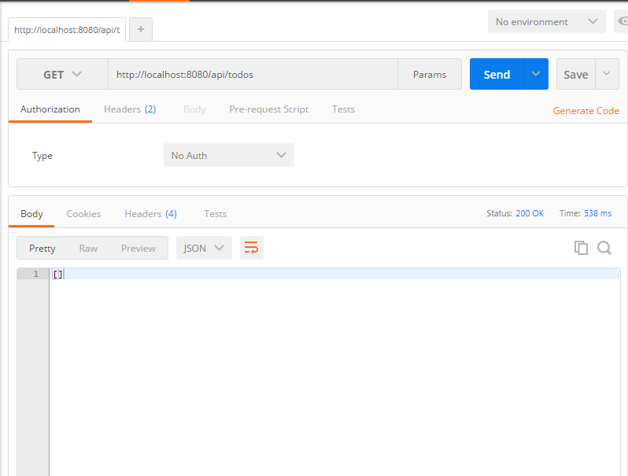
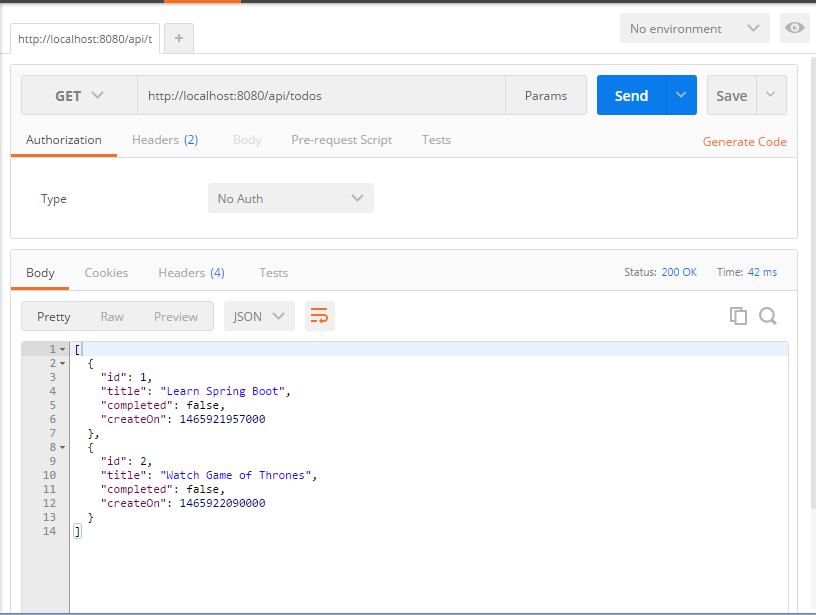

#Spring Boot with MySQL

We select **MySQL** as a database for this tutorial so make sure you download and have a mysql server running on your local machine. If you dont, its okay go to http://dev.mysql.com/doc/refman/5.7/en/windows-installation.html to get a step by step instruction.

#Building a Todo backend service with Spring Boot & MySQL

The Aim of this tutorial is to build a simple todo backend services which can be used with any front end framework to build an app.

##Directory Structure

    |___src
        |___main
            |__java
                |__todo
                    --TodoApplication.java
                    |__controllers
                        --TodoController.java
                    |__models
                        --Todo.java
                    |__repositories
                        --TodoRepository.java
            |__resources
                |__application.properties
    --pom.xml

**Note** : If you are using eclipse change the package name to **todo** or use the proper package name in the rest of the code.

Spring Boot picks up your java resources from the path src/main/java. TodoApplication.java is the entry class for our application.
All your resources are picked up from src/main/resources. It contains application.properties which includes database configuration.

##pom.xml

The pom.xml file looks like this..

    <project xmlns="http://maven.apache.org/POM/4.0.0" xmlns:xsi="http://www.w3.org/2001/XMLSchema-instance"
    xsi:schemaLocation="http://maven.apache.org/POM/4.0.0 http://maven.apache.org/maven-v4_0_0.xsd">
    <modelVersion>4.0.0</modelVersion>
    <groupId>com.amit</groupId>
    <artifactId>spring-sql-todo</artifactId>
    <packaging>jar</packaging>
    <version>0.0.1-SNAPSHOT</version>
    <name>Todo</name>
    <url>http://maven.apache.org</url>
    
    
    <parent>
            <groupId>org.springframework.boot</groupId>
            <artifactId>spring-boot-starter-parent</artifactId>
            <version>1.3.3.RELEASE</version>
        </parent>
    
    <dependencies>
        <dependency>
            <groupId>org.springframework.boot</groupId>
            <artifactId>spring-boot-starter-web</artifactId>
        </dependency>
        
        <dependency>
            <groupId>org.springframework.boot</groupId>
            <artifactId>spring-boot-starter-data-jpa</artifactId>
        </dependency>
        
        <dependency>
            <groupId>mysql</groupId>
            <artifactId>mysql-connector-java</artifactId>
        </dependency>
    </dependencies>
    </project>

###Install Dependencies

* If you are using eclipse, right click on the your project select **Run As** --> **Maven Install**                                                                                                                             

* if you are not using IDE, run the following from the root of the folder (make sure you have Maven installed)

        mvn install

##Connection Parameters for MySQL

MySQL credentials are specified in resources/application.properties file. You can see common application properties used by spring [here](https://docs.spring.io/spring-boot/docs/current/reference/html/common-application-properties.html)

    spring.datasource.driver-class-name=com.mysql.jdbc.Driver
    spring.datasource.url=jdbc:mysql://localhost/spring
    spring.datasource.username=#username
    spring.datasource.password=#password

    # Keep the connection alive if idle for a long time (needed in production)
    spring.datasource.testWhileIdle = true
    spring.datasource.validationQuery = SELECT 1

    # Show or not log for each sql query
    spring.jpa.show-sql = true

    # Hibernate ddl auto (create, create-drop, update)
    spring.jpa.hibernate.ddl-auto = update

    # Naming strategy
    spring.jpa.hibernate.naming-strategy = org.hibernate.cfg.ImprovedNamingStrategy

    # Use spring.jpa.properties.* for Hibernate native properties (the prefix is
    # stripped before adding them to the entity manager)

    # The SQL dialect makes Hibernate generate better SQL for the chosen database
    spring.jpa.properties.hibernate.dialect = org.hibernate.dialect.MySQL5Dialect

Make sure you have a local mysql server running on localhost or point to an approriate sql server url in `spring.datasource.url` (It makes a connection to spring database on your localhost by default. Please create the 'spring' Schema if you use the default url).

##Lets Code!! 

Lets start listening to the sweet keystrokes shall we?

###Application Class
The Application class is the starting point of spring boot's project. Create a TodoApplication.java in src/main/java/todo.

    package todo;

    import org.springframework.boot.SpringApplication;
    import org.springframework.boot.autoconfigure.SpringBootApplication;

    @SpringBootApplication
    public class TodoApplication {
        public static void main(String[] args){
            SpringApplication.run(TodoApplication.class, args);
        }
    }

The `@SpringBootApplication` annotation tells the Spring Boot that this is our main application class.The `main()` method uses Spring Boot's `SpringApplication.run()` to launch the application.
The `@SpringBootApplication` annotation is equivalent to using `@Configuration`, `@EnableAutoConfiguration` and `@ComponentScan` with their default attributes.

###Defining a model (not the super models.. DAMN!!!)

Spring Boot is a MVC(model view controller) architecture. A Model is mapped to a table in our DB. Create Todo.java inside src/main/java/todo/models

    package todo.models;

    import java.util.Date;

    import javax.persistence.Entity;
    import javax.persistence.GeneratedValue;
    import javax.persistence.GenerationType;
    import javax.persistence.Id;
    import javax.persistence.Table;

    import org.hibernate.validator.constraints.NotBlank;

    @Entity
    @Table(name="todos")
    public class Todo {
        
        @Id      //indicates that this field is a primary key
        @GeneratedValue(strategy = GenerationType.AUTO) 
        private long id;
        
        @NotBlank
        private String title;
        
        private Date createdOn = new Date();
        
        private Boolean completed = false;

        public long getId() {
            return id;
        }

        public void setId(long id) {
            this.id = id;
        }

        public String getTitle() {
            return title;
        }

        public void setTitle(String title) {
            this.title = title;
        }

        public Date getCreateOn() {
            return createdOn;
        }

        public void setCreateOn(Date createOn) {
            this.createdOn = createOn;
        }

        public Boolean getCompleted() {
            return completed;
        }

        public void setCompleted(Boolean completed) {
            this.completed = completed;
        }

        public Todo(String title) {
            super();
            this.title = title;
        }

        public Todo() {
            super();
        }
        
        

    }

The `@Entity` annotation indicates that the JavaBean is a persistent entity, JPA would automatically pick up this class.An `@Table` annotation can explicitly configure which table the entity is mapped to. In our case the `@Table(name="todos")` maps the entity to todos table.

Dont worry if you dont have this table in your database. Remember this line application.properties file `spring.jpa.hibernate.ddl-auto = update` this will create a table with the specied entity.

###Repository for accessing data
We will use `CrudRepository` for accessing/manipulating the data. It includes all the basic operations like creating, updating, deleting and retrieving items. If we need anything else, we can always create custom methods. Create TodoRepository.java inside src/main/java/todo/repositories –

    package todo.repositories;

    import java.util.List;

    import org.springframework.data.repository.CrudRepository;
    import org.springframework.stereotype.Repository;

    import todo.models.Todo;

    @Repository
    public interface TodoRepository extends CrudRepository<Todo, Long>{
        
        public List<Todo> findAll(); //returns all todos
        public Todo findOne(Long id);
        public Todo save(Todo todo);
        public void delete(Long id);

    }

###Controller

We define our APIs in this file.All apis in this controller will have a prefix `/api/todos` which is specified using `@RequestMapping`. In each controller method we call specific repository methods for accessing/modifying the data.

In src/main/java/todo/controllers create a class TodoController.java - 

    package todo.controllers;

    import java.util.List;

    import javax.validation.Valid;

    import org.springframework.beans.factory.annotation.Autowired;
    import org.springframework.http.HttpStatus;
    import org.springframework.http.ResponseEntity;
    import org.springframework.web.bind.annotation.PathVariable;
    import org.springframework.web.bind.annotation.RequestBody;
    import org.springframework.web.bind.annotation.RequestMapping;
    import org.springframework.web.bind.annotation.RequestMethod;
    import org.springframework.web.bind.annotation.RestController;

    import todo.models.Todo;
    import todo.repositories.TodoRepository;

    @RestController
    @RequestMapping("/api/todos")
    public class TodoController {

            @Autowired
            private TodoRepository todoRepository;
            
            @RequestMapping(method = RequestMethod.GET)
            public List<Todo>getAllTodos(){
                return todoRepository.findAll();
            }
            
            @RequestMapping(method = RequestMethod.POST)
            public Todo createTodo(@Valid @RequestBody Todo todo){
                return todoRepository.save(todo);
            }
            
            @RequestMapping(value="{id}", method = RequestMethod.GET)
            public ResponseEntity<Todo> findOne(@PathVariable("id") Long id){
                Todo todo = todoRepository.findOne(id);
                if(todo == null){
                    return new ResponseEntity<Todo>(HttpStatus.NOT_FOUND);
                }
                return new ResponseEntity<Todo>(todo,HttpStatus.OK);
            }
            
            @RequestMapping(value="{id}", method = RequestMethod.PUT)
            public ResponseEntity<Todo> updateTodo(@Valid @RequestBody Todo todo, @PathVariable("id") Long id){
                Todo todoDb = todoRepository.findOne(id);
                if(todoDb == null){
                    return new ResponseEntity<Todo>(HttpStatus.NOT_FOUND);
                }
                else{
                    todoDb.setTitle(todo.getTitle());
                    todoDb.setCompleted(todo.getCompleted());
                    todoDb = todoRepository.save(todoDb);
                    return new ResponseEntity<Todo>(todoDb,HttpStatus.OK);
                }
            }
            
            @RequestMapping(value="{id}", method = RequestMethod.DELETE)
            public void deleteTodo(@PathVariable("id") Long id) {
                todoRepository.delete(id);
            }
    }

In Spring’s approach to building RESTful web services, HTTP requests are handled by a controller. These components are easily identified by the `@RestController` annotation.  

`@RequestMapping` is used to map web requests to Spring Controller methods.

##Result

All right girls and guys we are done. To run the service
* If you are using eclipse right click on your project select **Run As** --> **Java Application** and select **TodoApplication** . To Stop the application gracefully press the red button (terminate) right of the console tab.

* if you wabt to run from the terminal then open a terminal and run the following from the root folder

        mvn spring-boot:run
Press `CTRL+C` to gracefully close the app.

If every thing is okay, and the code has no errors you would propably see this in the last line

    2016-06-14 21:57:35.879  INFO 8948 --- [main] todo.TodoApplication : Started TodoApplication in 8.5 seconds (JVM running for 14.439)

##Insert and get data

You could use [postman](https://www.getpostman.com/) to test your services.

* Start your postman app from your chrome app launcher

* Select `GET` from the dropdown and enter url as - `http://localhost:8080/api/todos` 

* you would get an empty response in body like this : 

  

* Select `POST` from the dropdown let the url be the same as previous one. Select the `body` option and click on `raw` radio box. Selct `JSON(application/json)` from the drop down next to the radio box.
  Enter the following for the body and press `send`.

       { "title": "Learn Spring Boot"}
    

* `Post` as many todos you want and then do a `GET`. My `GET` looked like this

    

* You can edit a todo by using `PUT` and calling url - `http://localhost:8080/api/todos/1` where /1 is the id of the todo you want to edit. send appropriate body to edit the todo title.

* Test Delete too.

#Front End soon
We will build a front end on top of this soon. For now go and do the stuff you mentioned in todo (mark it as done when complete) . Off to watching Game of thrones.

#Issues or Doubts
Please mail me at [amitrai48@gmail.com](mailto:amitrai48@gmail.com) for any doubts or issues.

#Content Contribution
If you find any error in this tutorial or you want to further contribute to the text, please raise a PR. Any contributions you make to this effort are of course greatly appreciated.
